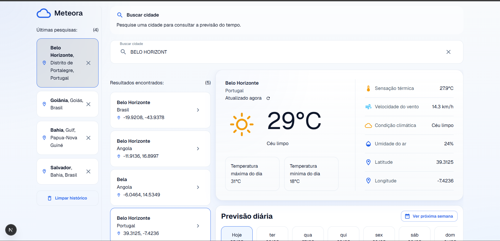
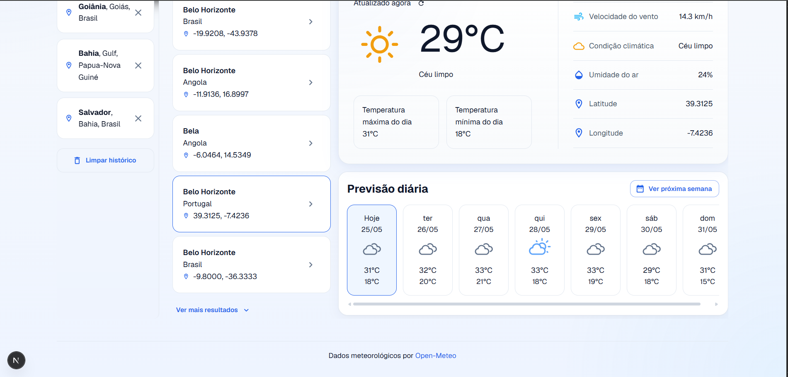

# ☀️ Meteora

Aplicação de previsão do tempo desenvolvida com **Next.js 16**, permitindo pesquisar cidades e visualizar condições climáticas em tempo real através da **Open-Meteo API**.

## Acessar projeto em Produção

[](https://weather-dashboard-nextjs-eight.vercel.app)

O projeto foi desenvolvido com foco em:

- Escalabilidade
- Boas práticas de Front-end
- Experiência do usuário (UX)
- Acessibilidade (a11y)
- Arquitetura desacoplada
- Performance

---

## Preview do projeto

> Consulta de clima atual, previsão dos próximos dias e histórico de pesquisas.

## 🎥 Demonstração


## Preview do projeto

### Busca de cidades

<p align="center">
  
</p>

---

### Forecast semanal

<p align="center">
  
</p>

---

## Demo

### Ambiente local

```bash
http://localhost:3000
```

---

# Tecnologias utilizadas

## Core

- **Next.js 16 (App Router)**
- **React 19**
- **TypeScript**

## UI & Estilização

- **Material UI (MUI)**
- **CSS Modules**
- **Theme customizado**

## Dados & APIs

- **Open-Meteo API**
- **Geocoding API**

## Arquitetura & Engenharia

- **Custom Hooks**
- **Debounce**
- **Separação da camada de API**
- **Route Handlers (Next.js API Routes)**
- **Service Layer**
- **Persistência com LocalStorage**
- **ESLint**
- **Prettier**

---

# Funcionalidades

## 🔍 Busca de cidades

Pesquisa dinâmica de cidades com controle otimizado de requisições.

### Recursos implementados

- Busca dinâmica por cidade
- Debounce (`400ms`)
- Match exato automático
- Seleção persistente
- Estados de loading
- Tratamento de erro
- Estado vazio
- Navegação por teclado

---

## Clima atual

Ao selecionar uma cidade, a aplicação exibe:

- Temperatura atual
- Sensação térmica
- Condição climática
- Velocidade do vento
- Umidade do ar
- Temperatura máxima do dia
- Temperatura mínima do dia
- Latitude e longitude

---

## Previsão diária

Visualização dos próximos dias de previsão meteorológica.

### Recursos implementados

- Forecast expandido
- Alternância entre semanas
- Scroll horizontal responsivo
- Ícones meteorológicos dinâmicos
- Temperatura máxima e mínima por dia

---

## Histórico de pesquisas

Persistência local das últimas cidades pesquisadas.

### Recursos implementados

- Histórico persistente
- Remoção individual
- Limpeza completa
- Evita duplicidade
- Limite de 5 cidades
- Seleção visual do item ativo

---

## 🌦️ Weather Code Mapping

Os códigos meteorológicos (**WMO Weather Codes**) da Open-Meteo são traduzidos para condições legíveis e ícones apropriados.

Exemplos:

| Código | Condição             |
| ------ | -------------------- |
| 0      | Céu limpo            |
| 2      | Parcialmente nublado |
| 61     | Chuva leve           |
| 71     | Neve leve            |
| 95     | Tempestade           |

A implementação utiliza um **mapper centralizado**, facilitando manutenção e escalabilidade.

---

# Decisões técnicas

## Por que App Router?

Foi utilizado o **App Router do Next.js** visando:

- Melhor organização do projeto
- Route Handlers (`/api`)
- Melhor estrutura arquitetural
- Recursos modernos do Next.js

---

## Por que CSS Modules?

Foi escolhido para:

- Escopo isolado por componente
- Menor risco de conflito de estilos
- Melhor manutenção
- Componentização mais previsível

---

## Por que Material UI?

Foi utilizado visando:

- Consistência visual
- Sistema de tema global
- Componentes acessíveis
- Escalabilidade de design system

---

## Por que separar a camada de API?

A aplicação utiliza **Route Handlers do Next.js** (`app/api`) como camada intermediária entre o client e a Open-Meteo API.

Arquitetura utilizada:

```txt
UI
↓
Hooks
↓
Services
↓
Route Handlers (/api)
↓
Open Meteo API
```

Benefícios:

- Menor acoplamento
- Melhor manutenção
- Centralização das integrações
- Mais aderente ao ecossistema Next.js

---

# Acessibilidade (a11y)

Foram aplicadas práticas de acessibilidade como:

- `aria-label`
- `aria-hidden`
- `focus-visible`
- Navegação por teclado
- Hierarquia semântica (`section`, `aside`, `footer`)
- Estados visuais de foco
- Feedback de loading

---

# Performance

## Debounce

Evita chamadas excessivas à API durante a digitação.

## AbortController

Cancela requisições antigas quando uma nova busca é iniciada.

## Persistência otimizada

Histórico salvo em `localStorage` sem renderizações desnecessárias.

## Skeleton Loading

Feedback visual durante carregamento de dados.

---

# 📁 Estrutura do projeto

```txt
src
├── tests
    ├── SearchInput.test.tsx
    ├── SearchResults.test.tsx
    ├── UseSearchHistory.test.tsx
├── app
│   ├── api
│   │   ├── cities
│   │   └── weather
│   │
│   ├── layout.tsx
│   ├── page.tsx
│   └── home.styles.ts
│
├── components
│   ├── EmptyState
│   ├── ErrorState
│   ├── Footer
│   ├── ForecastList
│   ├── LoadingState
│   ├── SearchHistory
│   ├── SearchInput
│   ├── SearchResults
│   ├── SearchSection
│   ├── Sidebar
│   ├── WeatherCard
│   └── WeatherMetrics
│
├── constants
│   ├── api.constants.ts
│   ├── search.constants.ts
│   └── weatherTheme.ts
│
├── hooks
│   ├── useCitySearch.ts
│   ├── useDebounce.ts
│   ├── useSearchHistory.ts
│   └── useWeather.ts
│
├── services
│   ├── city.service.ts
│   └── weather.service.ts
│
├── theme
│
├── types
│   ├── city.types.ts
│   ├── mui.d.ts
│   └── weather.types.ts
│
└── utils
    ├── keyboard.ts
    ├── weatherIcon.tsx
```

---

# Como executar o projeto

## Clone o repositório

```bash
git clone <url-do-repositorio>
```

## Instale as dependências

```bash
npm install
```

## Execute o projeto

```bash
npm run dev
```

Acesse:

```bash
http://localhost:3000
```

---

# Melhorias futuras

- [ ] Atualização automática do clima
- [ ] Sistema de favoritos
- [ ] Dark Mode
- [ ] Internacionalização (i18n)
- [ ] Refatorar ícones meteorológicos para configuração dinâmica, removendo mapeamentos hardcoded
- [ ] Refatorar gerenciamento de ícones meteorológicos para uma camada de configuração dinâmica, reduzindo hardcode e facilitando escalabilidade

---

### Autor

Desenvolvido por **Laysa**
